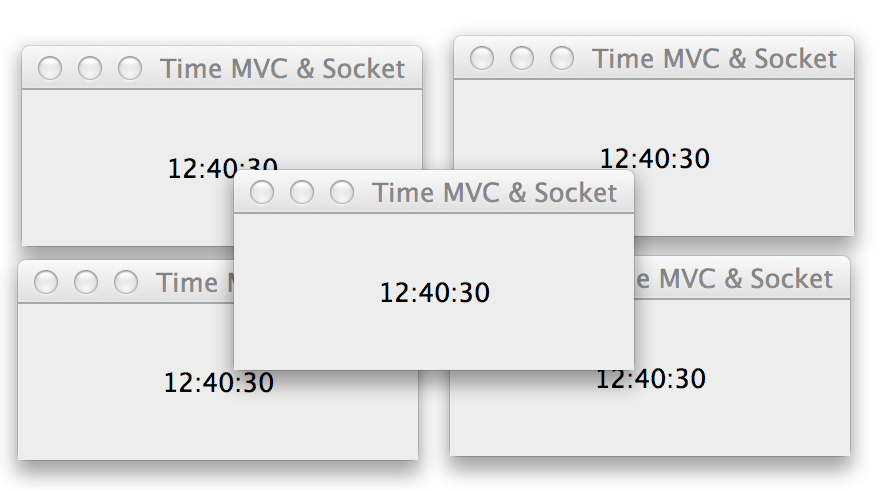

CSCI3465-Test2
==============

> Test 2 for CSCI 3465 Object-Oriented Programming with Java

---

## Problem 1

[See Issue #1](https://github.com/Glavin001/CSCI3465-Test2/issues/1)

> MVC implementation with sockets connecting to a time server.

## Problem 2

[See Issue #2](https://github.com/Glavin001/CSCI3465-Test2/issues/2)

> BankAccount, sortable and both thread-safe and not.

